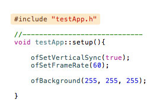

#### Chapter_02:
#Intro to C++ / compilers

When we are writing code, the main objective is to get from text that we are typing into some machine instructions the computer can operate on.  This process is called compiling and it looks like

When we are writing code, the main objective is to get from text that we are typing into some machine instructions the computer can operate on.  The process looks like

`Txt ( human ) -> Binary (machine instruction)`

   
Txt [ human ] :

	'HELLO WORLD' 

	
Binary [ machine ] :
	
	01001000 01000101 01001100 
	01001100 01001111 00100000 
	01010111 01001111 01010010 
	01001100 01000100 

Most programming languages use text files, plain text that you can open in any text editing software, but in the most cases we use an [IDE](http://), Integrated Development Environment, which allows to work in a specific programming language.

In the case of C++, the the compiler takes code written by humans and transforms it to machine level instructions ( assembly language ) for a specific processor (i.e. Intel). 

MORE ABOUT MACHINE LEVEL INSTRUCTIONS

#### There are 4 steps in compiling OF: 
1. Txt
2. Pre processor
3. Compile
4. link

<br />

---
<br />

# 1. Txt 
#### The Text Files
<br />

We start off writing text, and in c++ there are two kinds of files you will see: .h and .cpp files.  

The .h files are header files; they contain definitions. The .cpp files are implementation files; they contain the code that will describes program. Here are a few ways of thinking about the difference between the two files -- one way is cooking. When you have a recipe, you typically have two parts, the list of ingedients and the actual steps when you are cooking.  In this case, the .h file is the ingredients, just a list of you need. The .cpp file is cooking directions, the actual steps. Another anology is the index of a book -- you can think of the .h file like an index, and the .cpp file as the chapter of the book.   

    historical background - commercial code, releasing compiled lib and header files. 

The compiler's sole job is to compile .cpp files, it uses the .h files to get information that helps it compile.  The .h files provide a bridge from one .cpp file to another.

[MORE: how this relates to OF -- > reading h files, looking at the core of OF, etc]

<br />

---
<br />


# 2. Pre processor

The preprocessor is the next step in our progression from text to something you can run. All code that start with # are preprocessor comands. They will look like:

```#define M_PI 3.14```

```#include "ofMain.h"```

You can think about them as text processors, they change the actual text before you compile. For example, this: 

```#define PI 3.14```

says, if you see PI in the text, change it to 3.14.  Note, this is changing the actual text, not creating a variable called PI.  In #define, we typically use all capital letters to denote the value being a [constant](http://).  

### include 

One of the more common uses of the preprocessor comand, which you'll see everywhere in the code is the ```#include``` statement, that actually takes the content of one file (what's being inlcuded) and places it into another file.  Most cpp files will have a corresponding h file, and their .cpp files include that h file:

	


The inclusion of files is recursive, so if file (A) includes file (B) which include (C) and (D), A, after going through the preprocessor, will have B, C, and D inside of it.   Often times, libraries will have one master header file, that includes all the other files. In the case of openframeworks, that file is called ofMain.h, and if you look, it actually includes all the other header files in openframeworks. 
 
This is really useful. If you have an object, say a particle object, and you want it to be able to draw using openframeworks:

		show particle -> inlcudes ofMain includes ofGraphics 

### recursive includes

The problem with including files is that it sometimes can lead to issues where a file is included twice: 

		graphic + example showing including twice

The trick here is not to add a file multiple times. If you include a file twice, it's a bit like definining a variable twice, the compiler gets confused: 

		int pos;
		int pos;
		
Here, the compiler when it seems float pos the first time, will make a variable called pos which is a floating point number. but the second time, it will say, "wait, I've seen this name before, and you can't have multiple definitions with the same name!"  This is a multiple definition error.

The same kind of error can happen with recursive includes, so we need a system to prevent a file from being included multiple times.  This is called an include guard. There's an old school and new school way of doing it. 

###include guards

This means the compiler will compile the text in A or B, depending on if SOMETHING is defined or not.  This is used heavily in openframeworks for multiplatform compilation (for the adventurous, take a look at ofConstants.h, in the utils folder). There you'll see parts of code for windows, mac and linux all using #ifdefs.

The old schoool way uses some #define logic, and you'll see it at the start of and end of the "h" file, like this: 
    
        #ifndef THIS_FILE // that means "if THIS_FILE it's not defined"
        #define THIS_FILE // we defined so next time it will run over it will not pass across the previus comand

            ...
            ...
        
        #endif
    
The new school style, which you'll see in alot of the core of OF uses #pragma, which is a compiler directive, saying, "inlcude this file only once".  It looks like: 

		#pragma once

### include & search paths

Another important point about includes is that search paths are really important. And there is a big difference between using:

[MORE!]

    #include "local_file.h" 
    // means that is a local header file 
    // ( so it's in this project only )
    // and we are adding it
        
VS.
    
	#include <system_file.h
	// means it's a system file
    // so it's part of the system SDK more often seen
    // on linux because it looks to the /usr/include 
     
    
The errors you can get here are things like…

	Cant find "ofMain.h"

( ADD ERROR EXAMPLES )
( what do you do if you get this error? )

### example include errors


<br />

---
<br />


# 3. Compiler
 
The compiler's job in life is simple: to take the code that you've written and turn it into machine language instructions for the compiler that you are using. In other words, to take your .cpp files and turn them into .o files. It gets the text, after it's been preprocessed, and will go .cpp file by .cpp to make .o files. 

It's important to remember it doesn't do anything with the .h files, but they help the .cpp files compile and cross reference each other. 

There are typically different settings for your compiler -- for example, you can compile in debug and release, and the settings are different.  

### debug mode

In debug, specific information about the code, such as line numbers are baked into the output code, so that if your code needs to stop at a certain point, it can jump to the line number. Think about this like it's leaving little clues or breadcrumbs in your code. Your code will run slower (if it's not optimized), but it will be easier for the debugger to find it's way to the specific line that's running. 

### release mode

In release mode, optimization settings are enabled, meaning the compiler strives to make your code run faster.  Often times, optimization (speed) is traded off for file size.  It's beyond the scope of this document to get into compiler settings, but in general, we encourage you to poke around and to not be overly intimidated by all the switches provided to you.  Many of them are just for edge cases, and you don't need to worry about them.  The more you know about the compiler, the more you can experiment and use it to it's full advantage. 

With either compile setting, this process ends with lot's of .o files. Those are .cpp files compiled on binaries. 

	screenshot of .o files

### compiler errors

	wrong function names... types... bad syntax
	( ADD ERROR EXAMPLES )

<br />

---
<br />

# 4. Linker

In our code, we are many times calling functions that are in other files (otherwise we would have to code everything from scratch!). Our program must make jumps to get stuff from those files we are referencing. The linker takes .o files and figures out how to combine them together, and what the jumps from file to file are.

The linker start to put all the .o files together according to the headers. If it can't found it it will get a linker error

    Errors here are hard. 
    Means it can get the libraries (.a .lib .dll). 
    Or also because you have multiple function names and the compiler has a hard time linking one function on the .o file with the right header (.h). 

    ( ADD ERROR EXAMPLES )

You can compile libs or apps. 
So sometimes ( and in fact openFrameworks it self ) you go a cross all this process and get a lib at the end ( .a .lib .dll )

### linker target 

the target, ie, what it's making is either a compiled app (.exe / .app) or libs (.lib, .a)…  [more]

### linking errors

It's common sometimes to get errors at this point in the process.  Typically, it means the linker can't find the library (.a .lib .dll). 

errors with addons (two main.cpp files, for example)

errors with not implementing a function (ie you made the function name in the .h file, but never wrote it in the .cpp file)